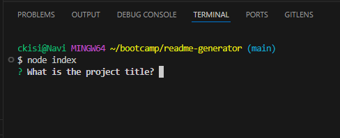
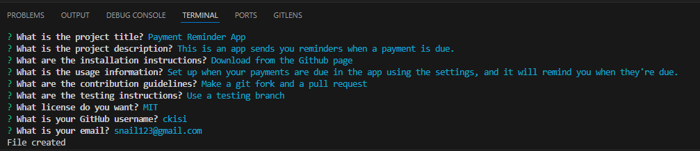
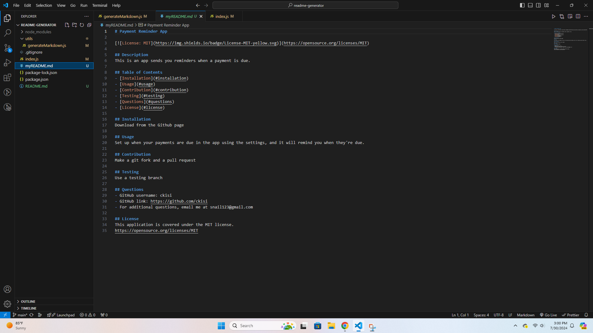
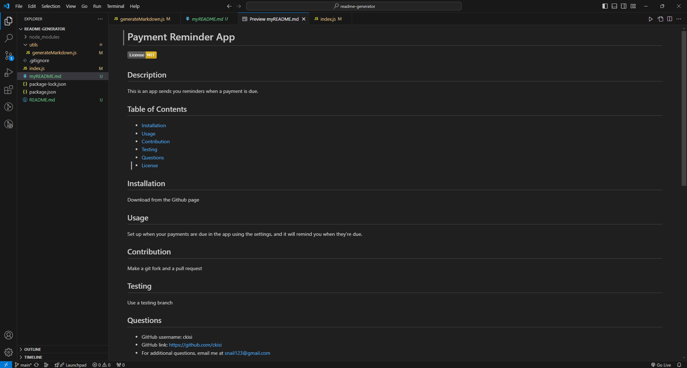

# README Generator

## Description
This is a README generator for developers, so that they can quickly make a README for a project. It automatically creates headers for every section, formats everything in markdown, and adds license badge and link. It also adds a table of contents that can be clicked.

## Usage
In order to use this generator, first open the terminal. Use the command "node index", and the program will start. Fill out all of the questions it asks, and then a file will be created called myREADME.md (You can rename this to README.md later) That will be your generated README.

## Technologies
- Node.js
- Npm Inquirer package

## Links
https://github.com/ckisi/readme-generator

## Video

## Screenshots

## Credits
Xpert Learning Assistance: For help with fs.writeFile